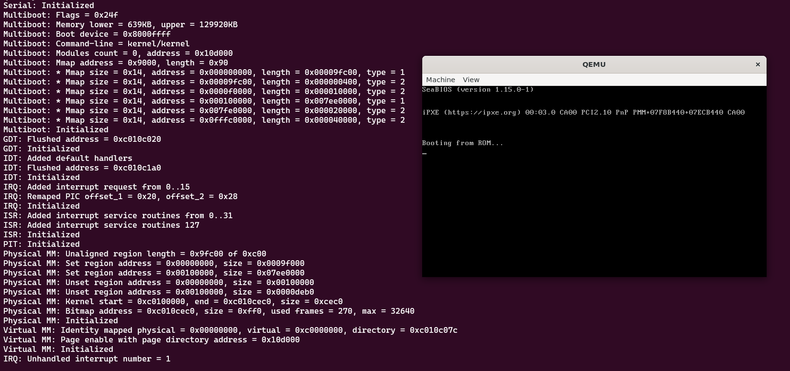

# NashiOS

NashiOS is a unix-like operating system built entirely from scratch. The NashiOS project started in May 2023 with the goal of being a complete and functional operating system (maybe in 10 years?). The name comes from the fruit [Pyrus pyrifolia](https://en.wikipedia.org/wiki/Pyrus_pyrifolia) which is a species of pear native to East Asia and is also called nashi pear.

*Nashi OS boot time*

## Building

See the [build instructions](documentation/build-instructions.md) file in the [documentation](documentation) folder. In this folder we can find system-specific code documents, guidelines documents and also some explanations about hardware or system functionality.

## Contributing

Pull requests are welcome. For major changes, please open an issue first
to discuss what you would like to change.

Please make sure to update tests as appropriate.

## Authors

* **Saullo** - [saullo](https://github.com/saullo)

## License

[GPL-3.0](https://choosealicense.com/licenses/gpl-3.0/)