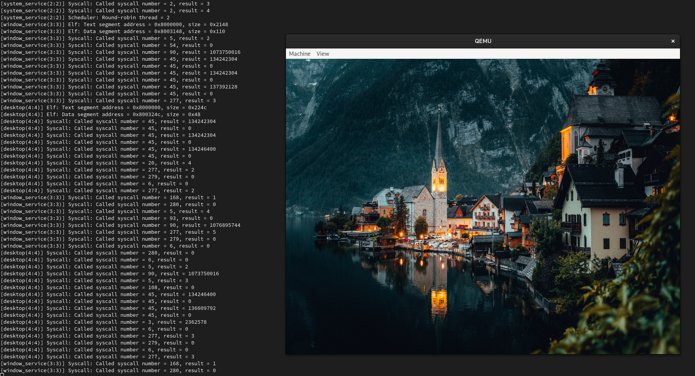

<p align="center">
    
</p>

[](https://github.com/nashios/nashios/actions/workflows/cmake.yml)
[](https://github.com/nashios/nashios/blob/main/LICENSE)
[](https://github.com/prettier/prettier)

## Introduction

NashiOS is a unix-like operating system built entirely from scratch. The NashiOS project started in May 2023 with the goal of being a complete and functional operating system (maybe in 10 years?). The name comes from the fruit [Pyrus pyrifolia](https://en.wikipedia.org/wiki/Pyrus_pyrifolia) which is a species of pear native to East Asia and is also called nashi pear.

## Screenshot


_Nashi OS boot time_

## Building

The starting point for building the NashiOS is the `meta/scripts/nashios.sh` script file. This script is responsible for building all the dependencies of the project and the project itself. To see more details about the script, run the following command:

```bash
./meta/scripts/nashios.sh help
```

## Contributing

Read our [contributing guide](https://github.com/nashios/nashios/blob/main/CONTRIBUTING.md) to learn about our development process, how to propose bugfixes and improvements, and how to build and test your changes.

## Contact

We receive your feedback and suggestions via the following channels:

- [GitHub Issues](https://github.com/nashios/nashios/issues)

## Authors

- **Saullo** - [saullo](https://github.com/saullo)

## License


NashiOS is free and open-source software, you can redistribute it and/or modify it under the terms of the [GNU General Public License](https://www.gnu.org/licenses/gpl-3.0.en.html) as published by the Free Software Foundation, either version 3 of the License, or (at your option) any later version. See the [LICENSE](LICENSE) file for more details.
